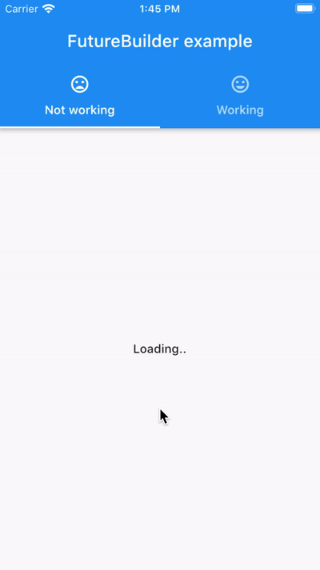
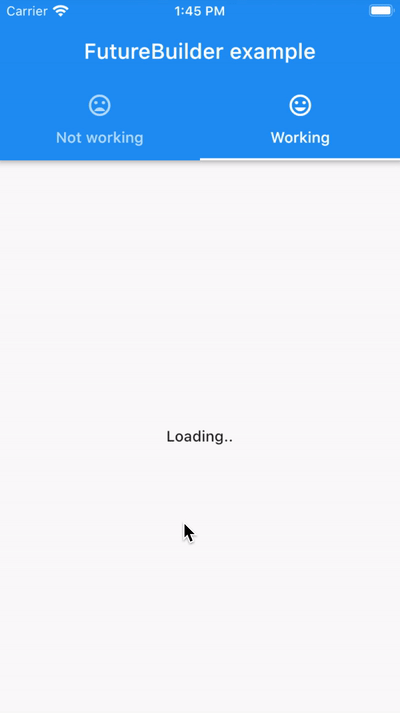

# using the future loader

Shows how to reset the FutureBuilder with a new future.

The future loader is an excellent way to easily handle the three render states of a an async operation:

1. Loading
2. Success
3. Failure

However, as this project shows, the flutter base `FutureBuilder` has an issue.

When trying to re-run the future, replacing it with a new one, we hit the issue that the snapshot state, `hasData` or `hasError` is not being reset.

## solution

In addition to only detecting the state based on `hasData` and `hasError` also make sure to look at the `connectionState`, if it is in `waiting`, the future is still running.

```dart
final builder = FutureBuilder(
    future: _future,
    builder: (context, snapshot) {
      if (snapshot.connectionState != ConnectionState.done) {
        return _buildLoader();
      }
      if (snapshot.hasError) {
        return _buildError();
      }
      if (snapshot.hasData) {
        return _buildDataView();
      }     
      return _buildNoData();
});
```    

## issue

The `FutureBuilder` is indeed rebuilt when setting a new future but the `data` of the `AsyncSnapshot<T>` it not being reset, only the `connectionState`.

This happens in the `didUpdateWidget` which afterwards also rebuilds the component. But as we can see, instead of recreating the `_snapshot` completely, only the `ConnectionState` is updated.

```dart
  @override
  void didUpdateWidget(FutureBuilder<T> oldWidget) {
    super.didUpdateWidget(oldWidget);
    if (oldWidget.future != widget.future) {
      if (_activeCallbackIdentity != null) {
        _unsubscribe();
        // Snapshot state is reset here
        _snapshot = _snapshot.inState(ConnectionState.none);
      }
      _subscribe();
    }
  }
```

## example view

Not future builder working, `hasData` and `hasError` is not cleared:



Working example, using `ConnectionState`:

